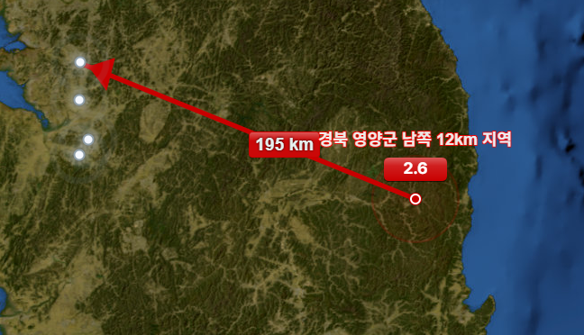

<p align="center">
  
</p>

<h1 align="center">삼성 DS EQMS 지진 모니터링 시스템</h1>
<h3 align="center">Samsung DS — EQMS Earthquake Monitoring System</h3>
<p align="center">Developed by Mohammad Tanvir</p>
<p align="center">Samsung DS — EQMS Project</p>

---


---

## 📌 Overview

This project implements a **directional distance arrow visualization** feature
for the Samsung DS EQMS (Earthquake Monitoring System) interactive map interface.

The feature renders a directional red arrow and distance label between detected
**earthquake epicenter coordinates** and **Samsung DS seismic monitoring station**
locations, using **Leaflet.js** vector layers and precise pixel-space vector math.

---

## 🗺️ Output Visualization

<p align="center">
  
</p>

> Directional red arrow from epicenter (경북 영양군 남쪽 12km, M2.6) to Samsung DS monitoring stations — distance label **195km** rendered at midpoint.

---

## 📁 Project Structure
```
samsung-ds-eqms/
├── EventAnalysis_ReportForm.js      # Leaflet map controller — arrow visualization
├── EventAnalysis_ReportForm.cshtml  # ASP.NET Core Razor view integration
├── docs/
│   ├── output.png                   # Final approved visualization screenshot
│   └── 일일업무보고서_20260309_EQMS_화살표시각화.pdf
└── README.md
```

---

## 🛠️ Tech Stack

| Component | Detail |
|---|---|
| Language | JavaScript (ES6+) |
| Map Library | Leaflet.js |
| Rendering | HTML5 Canvas + SVG |
| PDF Export | html2canvas + jsPDF |
| Backend | ASP.NET Core MVC |
| Dev Tools | Visual Studio + Chrome DevTools |

---

## 📅 Development Log

| Date | Feature | Status |
|---|---|---|
| 2026-03-09 | Directional arrow visualization | ✅ Approved by 심근영 대리님 |

---

*Samsung DS — EQMS Project · Confidential (대외비)*
